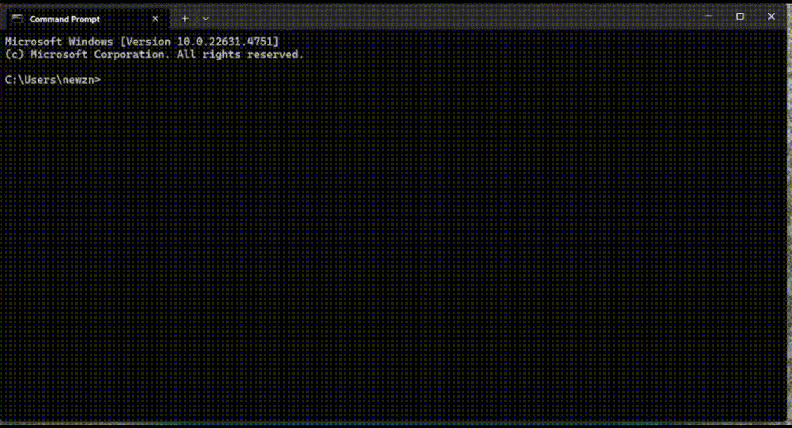

# ask

A command-line tool for asking questions directly from your terminal.

## Installation

### Option 1: Using `go install` (Recommended)

The simplest way to install:

```bash
go install github.com/nikitazuevblago/ask@latest
```

This will automatically install the binary in your Go path.

### Option 2: Manual Installation

1. Clone the repository:
```bash
git clone git@github.com:nikitazuevblago/ask.git
```

2. Navigate to the repository:
```bash
cd ask
```

3. Add to PATH:

#### Windows
1. Copy the full path to the `ask` folder
2. Open System Properties (Win + Pause)
3. Click "Advanced system settings"
4. Click "Environment Variables"
5. Under "System Variables", find and select "Path"
6. Click "Edit"
7. Click "New"
8. Paste the path to the `ask` folder
9. Click "OK" on all windows

#### Linux/MacOS
Add this line to your `~/.bashrc`, `~/.zshrc`, or equivalent:
```bash
export PATH="$PATH:/path/to/ask/folder"
```
Replace `/path/to/ask/folder` with the actual path where you cloned the repository.

Then reload your shell configuration:
```bash
source ~/.bashrc  # or ~/.zshrc
```

## Usage

After installation, you can use the tool from anywhere by typing:

```bash
ask "list all files in the current directory"
```

## Example



## Requirements

- Go 1.21 or later

## License

MIT License 